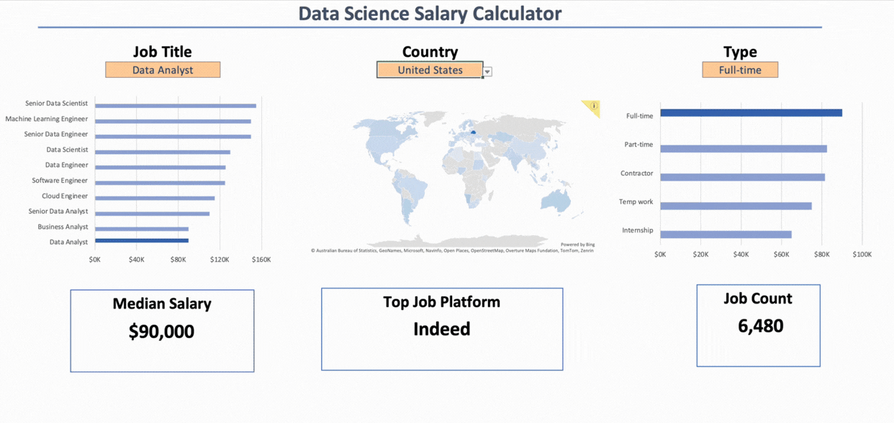
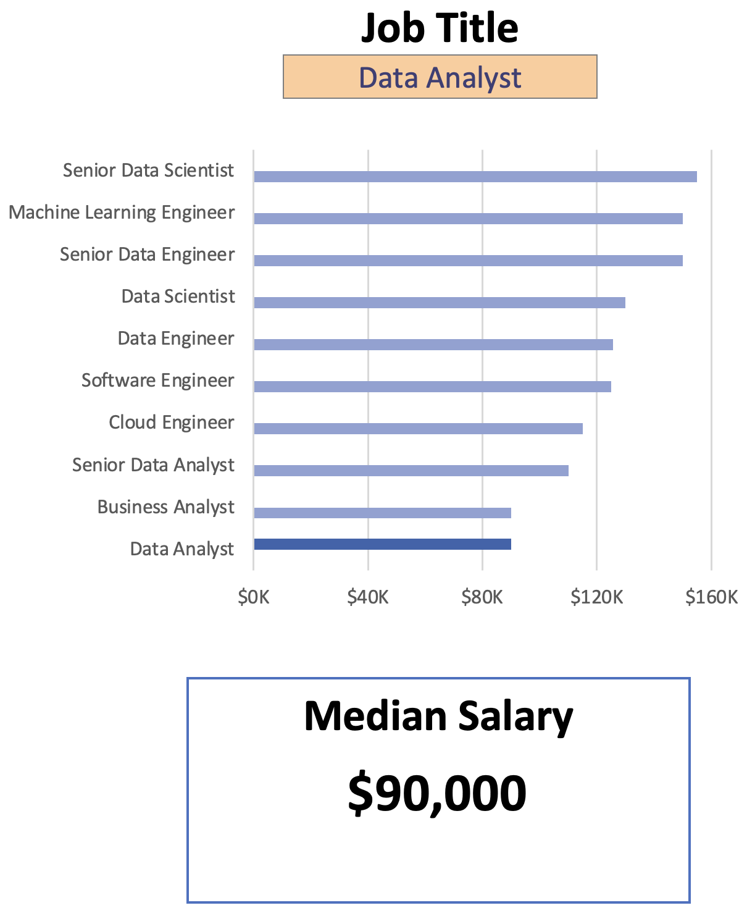
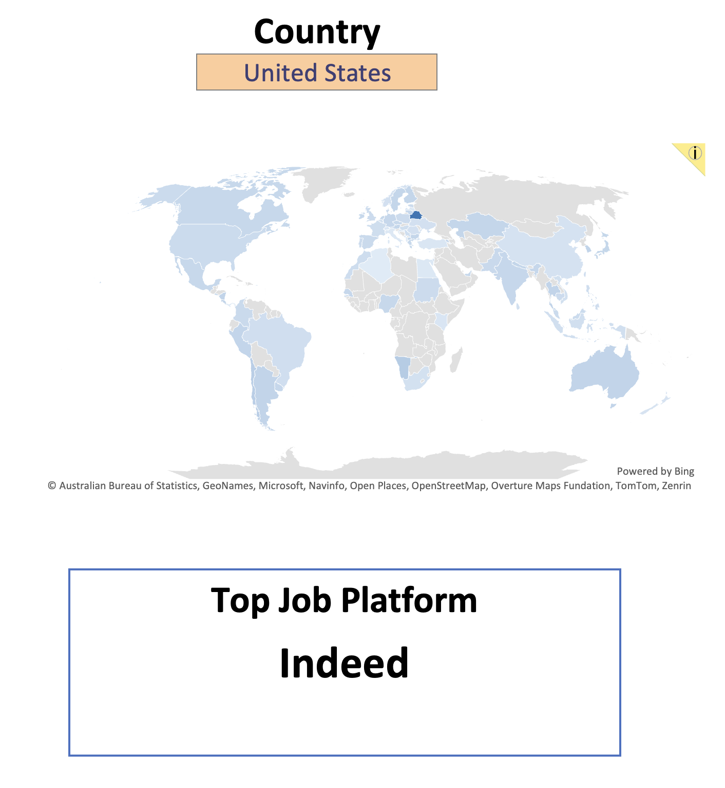
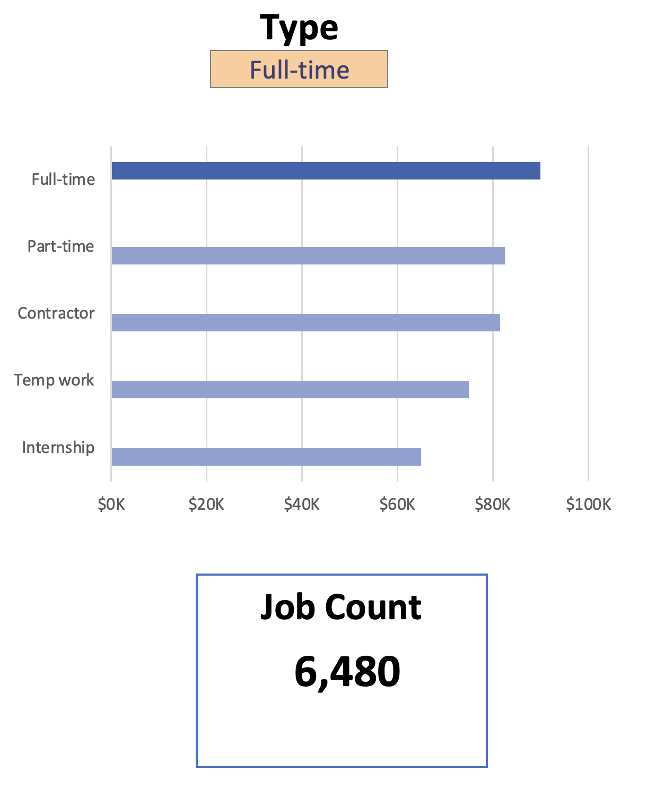

# Excel Salary Dashboard

## Introduction

This Data Jobs Salary Dashboard was created to help job seekers explore salary trends across data-related roles and better understand how factors like location, job type, and experience impact compensation.

The dataset comes from an Excel course focused on data analysis and includes detailed information on job titles, salaries, locations, and required skills.

Source of dataset:
https://huggingface.co/datasets/lukebarousse/data_jobs

## Dashboard File

The dashboard can be accessed in the following file: `Salary_Dashboard.xlsx`

## Excel Skills Used

- 📉 Charts (Bar Chart, Map Chart)
- 🧮 Formulas & Functions (e.g., MEDIAN, FILTER, SEARCH)
- ❎ Data Validation
- 📊 Data Cleaning & Structuring

## Dashboard Features

### 1️⃣ Data Science Job Salaries (Bar Chart)
- Design: Horizontal bar chart for easy comparison
- Data Handling: Sorted by descending median salary
- Insight: Senior and engineering roles tend to have higher salaries than analyst roles

### 2️⃣ Country Median Salaries (Map Chart)
- Design: Color-coded global map
- Functionality: Color-coded map to visually differentiate salary levels across regions. Additionally highlights which job platforms/websites are most commonly used below
- Insight: Highlights global salary disparities and high-paying regions

### 3️⃣ Count by Job Schedule Type (Bar Chart)
- Design: Horizontal bar chart comparing salaries across schedule types (e.g., Full-time, Part-time)
- Uses dynamic filtering and calculated metrics
- Insight: Full-time roles generally offer higher and more stable salaries compared to other job types

## Key Insights
- Senior and specialized roles command higher salaries
- Salaries vary significantly by country
- Job type (e.g., full-time vs contract) impacts pay
- Data roles show strong global demand

## What I Learned
- Designing dashboards for decision-making and usability
- Transforming raw data into actionable insights
- Applying Excel formulas for dynamic analysis
- Structuring data for interactive visualisation

## Acknowledgements

- Credits to Luke Barousse for the **[Excel for Data Analytics - Full Course for Beginners](https://www.youtube.com/watch?v=pCJ15nGFgVg )** tutorial, which guided the development of this project.
